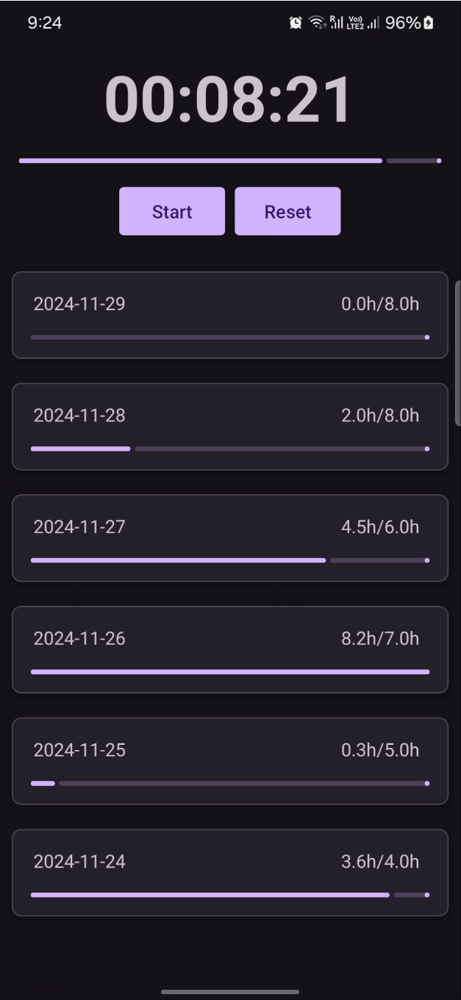
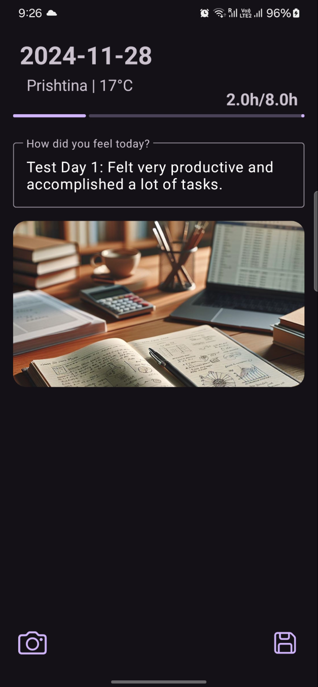

<div align="center">

# [DataDoro](https://github.com/KlevisImeri/DataDoro)
A collecting data pomodoro timer

<div style="display: flex; justify-content: space-between;">
    
    
</div>

### You can watch the explanation in this [video](https://youtu.be/yJ25sk2I6bI).
</div>


To run:
```
bash r.sh
```

To log:
```
bash logcat.sh
```

TO DO:
- More testing (5/10)   
  - When you deny the notification X
  - When you deny the location x
  - When you only approximate location x
  - When you accept location x
  - When you deny the camera 
  - When you accept the camera
- Refoctoring is needed (3/10)
- @String resorse for hardcoded string -> lanuage specific (1/10)
