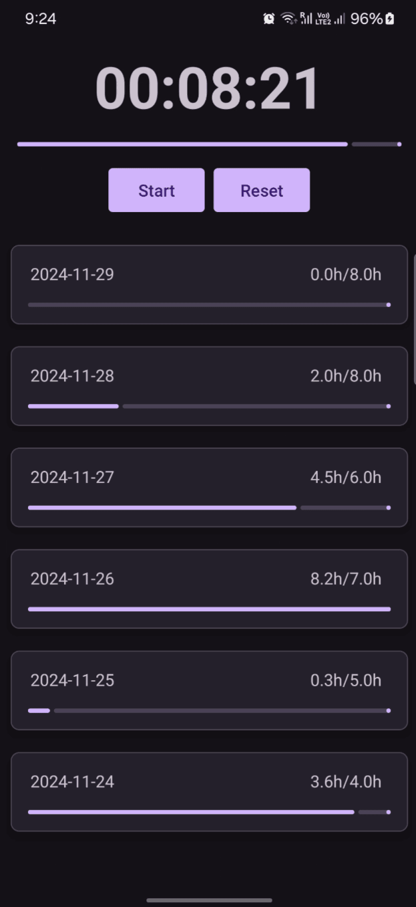

<center>
    <h1>DataDoro</h1>
    <p >A collecting data pomodoro timer</p>
</center>

<div style="display: flex; justify-content: space-between;">
    
    
</div>

To run:
```
bash r.sh
```

To log:
```
bash logcat.sh
```

TO DO:
- More testing (5/10)   
  - When you deny the notification X
  - When you deny the location x
  - When you only approximate location x
  - When you accept location x
  - When you deny the camera 
  - When you accept the camera
- Refoctoring is needed (3/10)
- @String resorse for hardcoded string -> lanuage specific (1/10)
